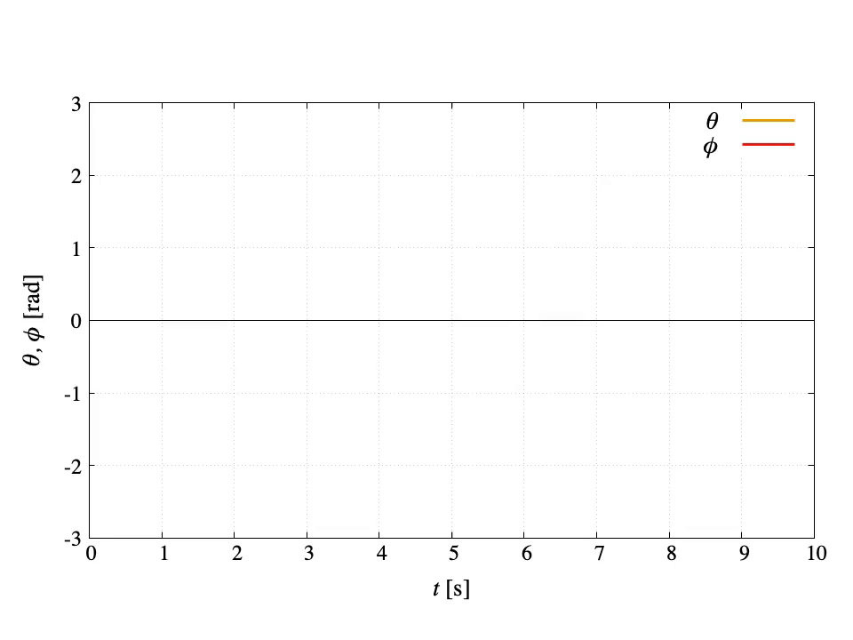

# Inverted Pendulum Simulation
"inverted-pendulum-simulation" is a simulator of an inverted pendulum with gnuplot.
The controller of this simulator is **Proportional-Differential (PD) controller**.

## Demo
|||
|---|---|
|Animation|Graph|

||
|---|
Combine animation and graphing using `multiplot`

## Modeling
Under construction... (Please refer the following video)  
https://youtu.be/DK-Y94pYS-o  
[![Segway Simulation [gnuplot]](http://img.youtube.com/vi/DK-Y94pYS-o/0.jpg)](https://youtu.be/DK-Y94pYS-o "Segway Simulation [gnuplot]")

## Features
You enable to switch terminal type `qt` or `pngcairo` by using **`qtMode`**.
- If you select `qt` terminal (`qtMode==1`), gnuplot opens qt window and you can run this simulator.
The drawing speed of the qt window can be adjusted with the `pause` command and the variable `DELAY_TIME`.

- On the other hand, in `pngcairo` terminal (`qtMode!=1`), you can get a lot of PNG images of the simulation.
By using the outputted images, you can make a video or an animated GIF.

<!-- # Operating environment -->
## Requirement
- macOS Big Sur 11.5.2 / Macbook Air (M1, 2020) 16GB
- gnuplot version 5.4 patchlevel 2
- VScode 1.60.0
- FFmpeg 4.4

<!-- # Installation -->
 
## Usage
```
git clone https://github.com/hiroloquy/inverted-pendulum-simulation.git
cd inverted-pendulum-simulation
gnuplot
load 'inverted_pendulum_multiplot.plt'
```

## Note
I made a MP4 file (demo.mp4) and an animated GIF (demo.gif) by using **FFmpeg**.

### MP4
```zsh
cd inverted-pendulum-simulation
script_type=multiplot # multiplot / anime / graph
ffmpeg -framerate 60 -i png_$script_type/img_%04d.png -vcodec libx264 -pix_fmt yuv420p -vf "scale=trunc(iw/2)*2:trunc(ih/2)*2" -r 60 demo_$script_type.mp4
```

### GIF
```zsh
cd inverted-pendulum-simulation
script_type=multiplot # multiplot / anime / graph
ffmpeg -i demo_$script_type.mp4 -filter_complex "[0:v] fps=30,split [a][b];[a] palettegen [p];[b][p] paletteuse" demo_$script_type.gif
```

## Author
* Hiro Shigeyoshi
* Twitter: [@hiroloquy](https://twitter.com/hirloquy)

### Blog
Under construction...
<!-- This article is written in detail and in Japanese. You can translate it in your language.  
https://hiroloquy.com/2021/07/11/rounded-pentagram-animation/ -->

### YouTube
http://www.youtube.com/watch?v=fy02lYygcj0  
[![Inverted Pendulum Simulation [gnuplot] #Shorts](http://img.youtube.com/vi/fy02lYygcj0/0.jpg)](http://www.youtube.com/watch?v=fy02lYygcj0 "Inverted Pendulum Simulation [gnuplot] #Shorts")

## License
"inverted-pendulum-simulation" is under [MIT license](https://github.com/hiroloquy/inverted-pendulum-simulation/blob/master/LICENSE).
 
